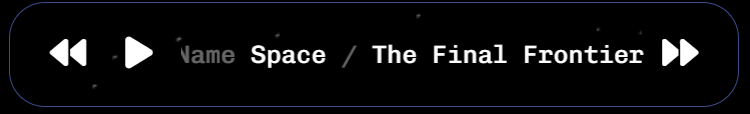

# Lovelace Background Animations 

Replace Home Assistant's background with an background animation!

Preview backgrounds here: https://ibz0q.github.io/lovelace-bg-animation/ or here: [docs/EXTENDED.md](https://github.com/ibz0q/lovelace-bg-animation/blob/main/docs/EXTENDED.md)


**Current Release: v1.1.2**

<p align="center">

[](https://i.imgur.com/f3hLlRu.mp4)
</p>

 
## 🎀 Tributes (Artists featured)

 - Jack Rugile (13)
 - Ben Matthews (8)
 - Dillon (6)
 - Alex Andrix (5)
 - Bas Groothedde (5)
 - Matei Copot (5)
 - Boris Šehovac (4)
 - Ibz (2)
 - Scott Weaver (2)
 - Kevin Levron (2)
 - Akimitsu Hamamuro (2)
 - AzazelN28 (1)
 - Liam Egan (1)
 - Lanny (1)
 - Matthias Hurrle (1)
 - Karl Saunders (1)
 - Ray Victor PRO (1)
 - tympanus (1)
 - Griffin Moyer (1)
 - Yuki (1)
 - Original Author (1)
 - yoichi kobayashi (1)
 - nskrgv (1)
 - Nathan Gordon (1)
 - Jared Stanley (1)
 - Ksenia Kondrashova (1)
 - Ana Tudor (1)
 - MenSeb (1)
 - Júlia Erő (1)
 - DanDog (1)
 - Tim Severien (1)
 - cssscript.com (1)
 - Takeshi Kano (1)
 - Andreas Wilcox (1)
 - alphardex (1)
 - Home Assistant Team (1)
 - Sarah Drasner (1)
 - Fabio Ottaviani (1)

### 🙏 Contributors

 - [Sjors Kaagman](https://github.com/SjorsMaster) (2)


### Install with HACS 

Search "Live Background Animations" in HACS and Install.

### Install manually

Download latest release zip. Extract `dist` into a new folder inside www: homeassistant\config\www\lovelace-background-animation ***e.g.***
```
homeassistant\config\www\lovelace-background-animation\
homeassistant\config\www\lovelace-background-animation\dist\
homeassistant\config\www\lovelace-background-animation\dist\bg-animation.min.js
...
```

Go to Lovelace dashboard: Edit -> Manage Resources -> Add resource -> URL: /local/lovelace-bg-animation/dist/bg-animation.min.js -> Javascript Module and click Create.

--- 

A config needs to be placed inside Lovelaces config file, you can do this inside the Lovelace UI > Edit mode > Raw Configuration Editor.

### Starter configuration

```yaml
bg-animation:
  duration: 60000 # Global duration of each bg
  transparency: # Sets the header transparent (Optional)
    header:
      enable: true
  background:
    global: 
      - id: animation.88.fish-tank
      - id: animation.64.howls-moving-castle
      - id: animation.17.ribbons
      - id: animation.63.green-circuit
      - id: animation.58.browniandrix-noise-l3
      - id: animation.53.stars
      - id: animation.50.sidelined
```
### Configuration options (Advanced)
` * = Optional `

```yaml
bg-animation: 
  duration: 50000 # * Duration of the animation in milliseconds (global)
  loadTimeout: 5000 # * In milliseconds - When Iframe takes longer than this value to load, it is forced to be displayed
  cache: true # * If false, nothing will be cached
  conditions: # *
    regex_device_map: # Any names of your devices 'iPhone12ProMax'
       iPhone12ProMax: # An array of regex patterns
         -  AppleWebKit.*12PROMAX.*
       FullKioskBrowserHallway:
         -  .*FullyKioskBrowserHallway.*
  transition: # *
    enable: true
    duration: 1000 # Transition duration in milliseconds
  parentStyle: "position: fixed; right: 0; top: 0; min-width: 100vw; min-height: 100vh; z-index: -10;" # * Root container style
  transparency: # *
    header:
      enable: true # Enable header transparency
      style: ".header {background: transparent !important;}" # Custom header style
    sidebar:
      enable: false # Enable sidebar transparency
      style: "background: transparent !important;" # Custom sidebar style
  gallery: # *
    type: "remote" # Type of gallery: "local" | "remote"
    localRootPath: "/local/lovelace-bg-animation/dist" # Local gallery root path
    manifestFileName: "gallery.manifest" # Gallery manifest filename
    remoteRootUrl: "https://ibz0q.github.io/lovelace-bg-animation" # Remote gallery URL
  sort: "random" # * Order backgrounds will be displayed: "random" | "reverse" | "id_asc" | "id_desc"
  background:
    global: # Global background settings
      - id: animation.11.space # Background identifier
        style: "min-width: 100vw; min-height: 100vh; border:0; overflow: hidden;" # * Custom iframe style
        cache: true # * Enable caching for this background
        duration: false # * Override global duration
        redraw: 5000 # * Redraws the iframe - must be above 500 ms otherwise ignored.
        conditions: # *
          include_users: [username1, username2] # Only show for these users
          exclude_users: [username3] # Don't show for these users
          include_devices: [device1] # Only show on these devices
          exclude_devices: [device2] # Don't show on these devices
    view: # View-specific background settings e.g. http://homeassistant/lovelace/lights - "lights"
      lights: # Settings for the 'lights' view
        - id: animation.11.space # Identifier for a background
          duration: 40000
          manifestOverride: # override any package manifest values 
            helpers:
              insert_baseurl: false
          conditions: # *
            exclude_users: [ibz] # Exclude these users
            exclude_devices: [iPhone12ProMax] # Exclude this device
        - id: animation.15.sound # Identifier for another background
      gruffalo: # e.g. http://homeassistant/lovelace/gruffalo - "gruffalo" etc
        - id: animation.11.space # Identifier for a background
          duration: 40000
        - id: application.1.media-background # Identifier for another background
          parameters:
            mediaList:
              - file: /images/somefile.png
                duration: 5000
                preload: auto
                stretchToFit: true
                muted: true
          duration: 40000 
```

There's also a card that let's you control bg's:



```YAML
type: custom:lovelace-bg-animation
```

## Contributions

PRs need to be attached to an issue that contains the following info:

- Image Preview
- name: description: author: source: 
- Does the package contain any of the following?
  - Javascript,
  -  Uncompiled code like pug, scss
- Have you audited the code yourself?

 
## Motivation

People created some pretty inspiring animations when HTML5/Canvas/JS/CSS3/Flash was new. There's still amazing artists doing this today. I wanted to curate these, use them on my Home Assistant tablet/dashboard, which incidentally make great backgrounds.

Unfortunately over time many older web experiments/animations have been lost to digital oblivion. Sometimes I would save these locally. I have tried my best to find references and credit the artists, archive.org links provided if they are available - This is not always the case.

### License 

This project is compromised of the works of artists each with their own licensing, none of THIS projects license are imposed. Copyrights and original licenses are preserved respectively. The reason for this is a lot of the works are published online under MIT license, ie. <a href="https://blog.codepen.io/documentation/licensing/#:~:text=The%20gist%20of%20it%20is,it%20is%20subject%20to%20removal">Code Pen</a> which is permissive and expects an equally permissive license or some were created at a time when licensing wasn't really a thing on the web. In some cases works aren't as permissive, or unlicensed. For this reason, code solely belonging to this repo (bg-animation.js) uses CC BY-NC 4.0 Deed Attribution-NonCommercial 4.0 International which prevents commercial use and works themselves have licenses preserved. 

## To do

- UX

  - Transparent Overlays
  - Iframe transitions (Done)
  - Create a basic background previewer site (better than EXTENDED.md)  
  - Add redraw, allows you to repaint the iframe within duration period. (Done)

- Extensibility

  -  basic interaction by exposing an API/function. Play, stop, start, track change (Done, but not mature)
  -  Global postMessage listener (Considering) 
  -  Add ability for Iframe/package to interact with Lovelace Card (Considering)

- Programmability 

  -  Add env variables within Iframe (Done) 
  -  Add env variables to Iframe via card config  

- Security

    - "Official bg packages" vs "Community packages" via YAML tagging
    - Provide a list of vetted libraries or CDNs
  - Provide a way to add libraries in a trusted manner (Done, docs incoming)
  - Add video background package  
  - Default gallery to use all, if nothing is specified. (Removed)

- Misc

  - Add video background package  
  - Add image background package with nice transitions
  - Add overlay div (Done)
  - Media controls (Lovelace Card) (Done)
  - Fix iframe writes (Done)
  - Add duration (Done)
  - Add opportunistic sanity check for path (Done)
  - Add BaseURL (Done)
  - Allow for multi instance (Done)
  - Auto generate metadata (Done)
    - Video/Picture Preview (Done)
    - HTML (Done)

